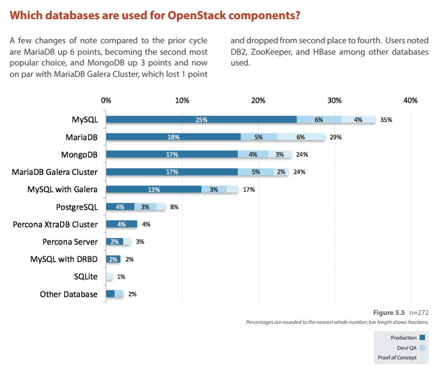

# MariaDB Server growth bolstered by OpenStack User Survey

While many are at the ongoing [OpenStack Summit in Austin](https://www.openstack.org/summit/austin-2016/), it came to my attention that the OpenStack project has recently published their latest [user survey](http://www.openstack.org/assets/survey/April-2016-User-Survey-Report.pdf). From there, it is clear that there is growth in the usage of MariaDB Server -- up 6 points from the [previous survey](https://www.openstack.org/assets/survey/Public-User-Survey-Report.pdf). MariaDB Galera Cluster dropped by 1 point, but its worth noting that in MariaDB Server 10.1, you're getting it all as an integrated download so it is quite likely that people are just referring to it as "MariaDB" now.

(Screenshot taking from the [user survey](http://www.openstack.org/assets/survey/April-2016-User-Survey-Report.pdf))

While MySQL still dominates at 35 percentage points, the largest pie of production OpenStack deployments are either based on MariaDB Server or MariaDB Galera Cluster which are developed by both the MariaDB Corporation & the MariaDB Foundation.

Some may say this is because "defaults matter" (as MariaDB Server gets to be the default in many Linux distributions), but the majority of OpenStack deployments today are using Ubuntu Server, which ships MySQL as a default provider when one requests for MySQL. So this is a conscious choice people are making to go with MariaDB Server or MariaDB Galera Cluster.

Thank you OpenStack deployers! If you ever want to talk about your deployment, feel free to drop me a [line](mailto:colin@mariadb.com) or even tweet [@bytebot](https://twitter.com/bytebot).